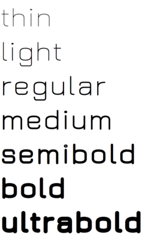

# Jura

Jura Font Project by Daniel Johnson (il dot basso dot buffo at gmail dot com)

N.B. The Jura family has an unfortunate name clash with Ed Merritt's Jura serif font,
which may be found [here](http://www.tenbytwenty.com/products/typefaces/jura).

This project is currently in active development by Alexei Vanyashin as part of the Font Improvement project.
This repo contains both original v2.26, and new v3.001 and up Development versions. 

[Jura Design Guideline](documentation/v3.001design-guide.md)

#### Web Specimen Deployment Tip

As you may have noticed this repo includes a [**webspecimen**](webspecimen) folder.
This is were the html files for the web specimen page are hosted. 
They are accessible online here: [http://alexeiva.github.io/jura](http://alexeiva.github.io/jura)

Normally to achieve this you would create a separate **gh-pages** branch, but it 
would be tediuos to switch between branches for each webpage update. 

There is a simple alternative deployment method:

1. Create a **webspecimen**[or any other name] folder with your html files in your **master** branch. Run these commands:

---
	gid add webspecimen && git commit -m "webpage update"
	git subtree push --prefix webspecimen origin gh-pages
 
2. Now your html files are accesible via http://[username/orgname].github.io/[projectname]
3. If you don't want this folder to appear in the master branch, add it to the .gitingore file, or use [subtree split](https://makingsoftware.wordpress.com/2013/02/16/using-git-subtrees-for-repository-separation/).

 
#### Goals of the new v.3 redesign:

- Add more weights
- Refine Cyrillic glyphs
- General design and spacing improvements

These goals will be achieved by drawing new masters and interpolating in-between weights. 

#### Roadmap of redesign

	[x] Concept
		[x] Light Master
		[ ] Bold Master
		[x] Test weights
	[ ] Design
		[ ] ASCII
		[ ] Cyrillic
		[ ] Greek
		[ ] Tibetan
		[ ] Latin Ext 
		[ ] Full glyphset
		[ ] Kerning
		[ ] Design testing
		[ ] OT Features
	[ ] Generate
		[ ] Glyphs Filters
	[ ] Push

## Specimen

## License

This Font Software is licensed under the SIL Open Font License, Version 1.1. 
This license is copied below, and is also available with a FAQ at 
http://scripts.sil.org/OFL

## Repository Layout

This font repository follows the Unified Font Repository v2.0, 
a standard way to organize font project source files. Learn more at 
https://github.com/raphaelbastide/Unified-Font-Repository

