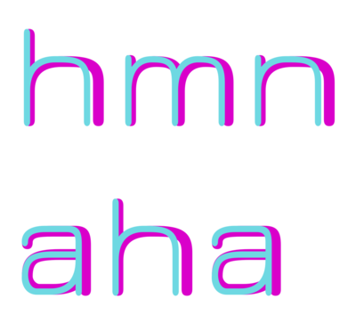
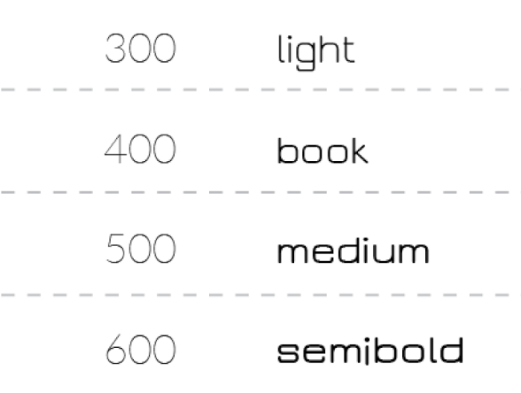

Design guidelines

### Problems in Version 2.26 

* inconsistent proportions across weights. Overlay of Light and SemiBold styles.

* limited scope of weights, and a small visual difference between them

### Version 3.001 

In order to resolve the issues, a redesign is needed. 

### Redesign Roadmap 

	[x] Concept
		[x] Light Master
		[x] Bold Master
		[x] Test weights
	[ ] Design
		[x] GF Latin Plus
		[ ] Cyrillic
		[ ] Greek
		[ ] Kayah Li
		[x] Kerning
		[x] Design testing
		[x] OT Features
	[x] Push
 
### Weight System

- Light 300  
- Regular 400
- Medium 500
- SemiBold 600
- Bold 700

 